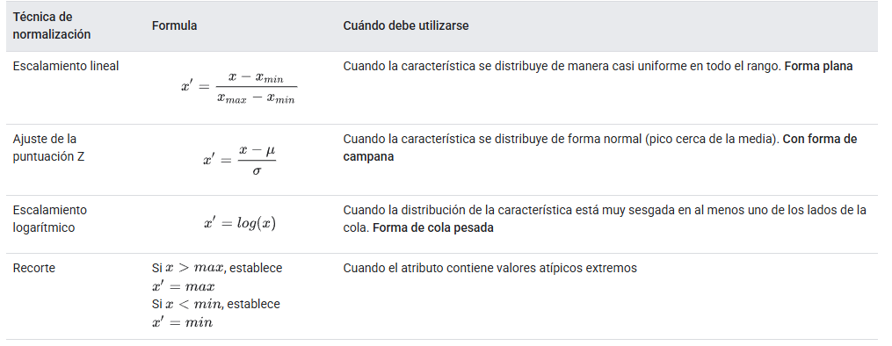
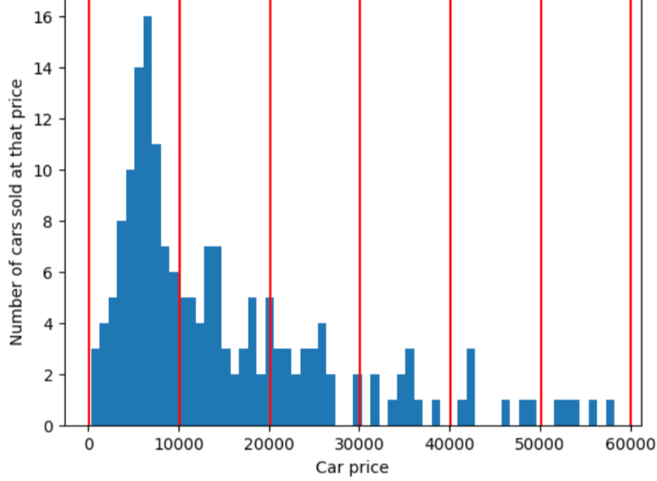
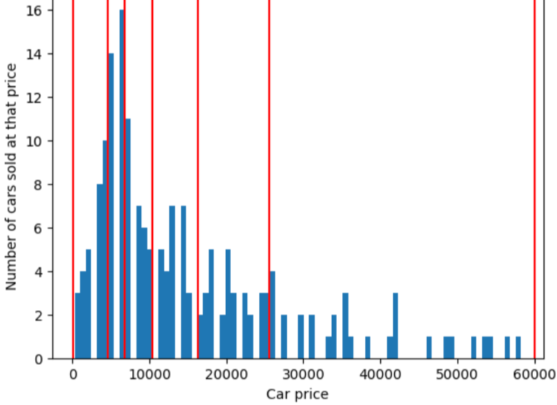

# Trabajar con datos numéricos
## Introducción
En ML,  evaluar, limpiar y transformar los datos es muy importante, incluso más que los propios modelos.
Los datos numéricos son aquellos números enteros o valores de punto flotante que se comportan como números. Es decir, son aditivos, contables, ordenados, etcétera. Mientras que los datos categóricos son objetos o números que se comportan como categorías.

## Cómo un modelo transfiere datos mediante vectores de atributos
De la tabla, sólo se cogen los atributos de las columnas pasadas al modelo, a este vector de valores es lo que se conoce como vector de características.

Sin embargo, los vectores de características rara vez usan los valores sin procesar del conjunto de datos. En cambio, por lo general, debes procesar los valores del conjunto de datos en representaciones de las que tu modelo pueda aprender mejor.

Debes determinar la mejor manera de representar los valores del conjunto de datos sin procesar como valores entrenables en el vector de atributos. Este proceso se denomina ingeniería de atributos y es una parte vital del aprendizaje automático. Las técnicas de ingeniería de atributos más comunes son las siguientes:

- Normalización:  Convierte los valores numéricos en un rango estándar.
- Agrupación(Agrupamiento): Convierte valores numéricos en buckets de rangos.

## Primeros Pasos
Antes de crear vectores de características, te recomendamos que estudies los datos numéricos de estas dos maneras:

- Visualiza tus datos en gráficos o diagramas.
- Obtén estadísticas sobre tus datos.

### Visualiza tus datos

Los gráficos pueden ayudarte a encontrar anomalías o patrones ocultos en los datos. Por lo tanto, antes de avanzar demasiado en el análisis, observa tus datos de forma gráfica, ya sea como diagramas de dispersión o histogramas. Consulta los gráficos no solo al comienzo de la canalización de datos, sino también durante las transformaciones de datos. Las visualizaciones te ayudan a verificar tus suposiciones de forma continua.

Te recomendamos trabajar con pandas para la visualización.

Ten en cuenta que algunas herramientas de visualización están optimizadas para ciertos formatos de datos. Es posible que una herramienta de visualización que te ayude a evaluar los búferes de protocolo pueda o no ayudarte a evaluar los datos CSV.

### Evalúa tus datos de forma estadística
Además del análisis visual, también recomendamos evaluar las posibles funciones y etiquetas de forma matemática y recopilar estadísticas básicas, como las siguientes:

- Media y mediana.
- Desviación estándar.
- Los valores en las divisiones de cuartil: los percentiles 0, 25, 50, 75 y 100. El percentil 0 es el valor mínimo de esta columna, y el percentil 100 es el valor máximo de esta columna. (el percentil 50 es la mediana).

### Cómo encontrar valores atípicos
Un valor atípico es un valor distante de la mayoría de los otros valores de un atributo o una etiqueta. Los valores atípicos suelen causar problemas en el entrenamiento del modelo, por lo que es importante encontrarlos.

Cuando la diferencia entre el percentil 0 y el 25 difiere significativamente de la diferencia entre el percentil 75 y el 100, es probable que el conjunto de datos contenga valores atípicos.

No dependas demasiado de las estadísticas básicas. Las anomalías también pueden ocultarse en datos que parecen estar bien equilibrados.

Los valores atípicos pueden pertenecer a cualquiera de las siguientes categorías:

- El valor atípico se debe a un error. Por ejemplo, es posible que un experimentador haya ingresado por error un cero adicional o que un instrumento que recopiló datos haya fallado. Por lo general, borrarás los ejemplos que contengan valores extremos por errores.
- El valor atípico es un dato legítimo, no un error. En este caso, ¿tu modelo entrenado necesitará, en última instancia, inferir buenas predicciones sobre estos valores atípicos?
    - Si es así, mantén estos valores atípicos en tu conjunto de entrenamiento. Después de todo, los valores extremos de ciertas características a veces reflejan los valores extremos de la etiqueta, por lo que los valores extremos podrían ayudar a tu modelo a realizar mejores predicciones. Ten cuidado, los valores atípicos extremos aún pueden perjudicar tu modelo.
    - De lo contrario, borra los valores atípicos o aplica técnicas de ingeniería de atributos más invasivas, como el recorte.

## Normalización 

Después de examinar tus datos con técnicas estadísticas y de visualización, debes transformarlos de manera que ayuden a tu modelo a entrenarse de forma más eficaz. El objetivo de la normalización es transformar las características para que estén en una escala similar.

La normalización proporciona los siguientes beneficios:

- Ayuda a que los modelos converjan más rápido durante el entrenamiento. Cuando las diferentes funciones tienen rangos diferentes, el descenso del gradiente puede "rebotar" y ralentizar la convergencia. Dicho esto, los optimizadores más avanzados, como Adagrad y Adam, protegen contra este problema cambiando la tasa de aprendizaje efectiva con el tiempo.
- Ayuda a los modelos a inferir mejores predicciones. Cuando las diferentes características tienen rangos diferentes, el modelo resultante podría generar predicciones algo menos útiles.
- Ayuda a evitar la "trampa de NaN" cuando los valores de las características son muy altos. NaN es la abreviatura de no es un número. Cuando un valor de un modelo supera el límite de precisión de punto flotante, el sistema establece el valor en NaN en lugar de un número. Cuando un número del modelo se convierte en NaN, otros números del modelo también se convierten en NaN.
- Ayuda al modelo a aprender los pesos adecuados para cada atributo. Sin el ajuste de atributos, el modelo les presta demasiada atención a los atributos con rangos amplios y no les presta suficiente atención a los atributos con rangos estrechos.

Recomendamos normalizar los atributos numéricos que abarcan rangos claramente diferentes (por ejemplo, edad e ingresos). También recomendamos normalizar un solo atributo numérico que abarque un amplio rango, como city population.

Hay tres métodos de normalización populares:

- Escalamiento lineal
- Ajuste de la puntuación Z
- Escalamiento logarítmico

 También está el recorte. Si bien no es una verdadera técnica de normalización, el recorte sí controla los atributos numéricos no controlados en rangos que producen mejores modelos.

 ### Escalamiento Lineal

 El escalamiento lineal (más comúnmente abreviado como escalamiento) significa convertir los valores de punto flotante de su rango natural a un rango estándar, generalmente de 0 a 1 o de -1 a +1.

 Usa la siguiente fórmula para escalar al rango estándar de 0 a 1, inclusive:
 $$ x'= (x-x_{min})/(x_{max}-x_{min})$$
 Donde:
 - $x'$ es el valor ajustado.
 - $x$ es el valor original.
- $x_{min}$ es el valor más bajo en el conjunto de datos de esta función.
- $x_{max}$ es el valor más alto en el conjunto de datos de esta función.

El ajuste de escala lineal es una buena opción cuando se cumplen todas las siguientes condiciones:

- Los límites inferior y superior de tus datos no cambian mucho con el tiempo.
- La función contiene pocos valores atípicos o ninguno, y estos no son extremos.
- La función se distribuye de forma aproximadamente uniforme en su rango. Es decir, un histograma mostraría barras casi uniformes para la mayoría de los valores.

La mayoría de las funciones del mundo real no cumplen con todos los criterios para el ajuste lineal. Por lo general, el escalamiento de la puntuación Z es una mejor opción de normalización que el escalamiento lineal.

### Ajuste de la puntuación Z

Una puntuación Z es la cantidad de desviaciones estándar que tiene un valor a partir de la media. Representar un atributo con el ajuste de escala de Z-score significa almacenar el Z-score de ese atributo en el vector de atributos. Además, la representación gráfica mantiene la distribución gráfica original.

Usa la siguiente fórmula para normalizar un valor x en su puntuación Z:
$$ x'=(x-\mu)/\sigma$$
Donde:
- $x'$ es la puntuación Z.
- $x$ es el valor sin procesar, es decir, el valor que normalizas.
- $\mu$ es la media.
- $\sigma$ es la desviación estándar.

La puntuación Z es una buena opción cuando los datos siguen una distribución normal o una distribución algo similar a una distribución normal.

Ten en cuenta que algunas distribuciones pueden ser normales dentro de la mayor parte de su rango, pero aun así contener valores atípicos extremos. Por ejemplo, casi todos los puntos de un atributo net_worth podrían ajustarse perfectamente a 3 desviaciones estándares, pero algunos ejemplos de este atributo podrían estar a cientos de desviaciones estándares de la media. En estas situaciones, puedes combinar el ajuste de la puntuación Z con otra forma de normalización (por lo general, el recorte) para controlar esta situación.

Ejercicio: Comprueba tus conocimientos
Supongamos que tu modelo se entrena con un atributo llamado height que contiene las alturas de diez millones de mujeres adultas. ¿El escalamiento de la puntuación Z sería una buena técnica de normalización para height? ¿Por qué?
- Pues si, para el atributo de altura, el escalamiento z es adecuado. Ya que suele seguir una distribución normal, la mayoría de la gente está próxima a la media, mientras que hay muy pocos que sufren de enanismo o gigantismo.

### Escalamiento logarítmico

El ajuste de escala logarítmica calcula el logaritmo del valor sin procesar. En teoría, el logaritmo podría tener cualquier base; en la práctica, el ajuste logarítmico suele calcular el logaritmo natural (ln).

El ajuste de escala logarítmica es útil cuando los datos se ajustan a una distribución de ley de potencias. En términos generales, una distribución de ley de potencias se ve de la siguiente manera:
- Los valores bajos de $X$ tienen valores muy altos de $Y$.
- A medida que aumentan los valores de $X$, los valores de $Y$ disminuyen rápidamente. Por lo tanto, los valores altos de $X$ tienen valores muy bajos de $Y$.

Son buenos los ejemplos de las calificaciones de películas o ventas de libros para aplicar esta técnica.

### Recorte

El recorte es una técnica para minimizar la influencia de los valores atípicos extremos. En resumen, el recorte suele limitar (reducir) el valor de los valores atípicos a un valor máximo específico. El recorte es una idea extraña y, sin embargo, puede ser muy eficaz.

Se basa en principalmente detectar una cota superior e inferior de la distribución normal o media, y entonces limitar los valores atípicos a que estén dentro de está frontera. También puedes recortar valores después de aplicar otras formas de normalización. 

El recorte evita que tu modelo se sobreindexe en datos sin importancia. Sin embargo, algunos valores atípicos son importantes, por lo que debes recortar los valores con cuidado.

### Resumen de las técnicas de normalización


## Discretización

La agrupación (también llamada agrupamiento) es un ingeniería de atributos técnica que agrupa diferentes subrangos numéricos en discretizaciones o buckets. En muchos casos, la discretización convierte datos numéricos en datos categóricos. 

Cuando discretizamos, convertimos un atributo de una columna en un vector de atributos de longitud $N$, donde N es el número de rangos que hemos definido. En este vector, la instancia llevará un 1 en la entrada $n'$ y el resto del vector con ceros. Estos se consideran atributos separados. Por lo tanto, el modelo aprende pesos separados para cada discretización.

La discretización es una buena alternativa al escalamiento o recorte cuando cualquiera de los se cumplen las siguientes condiciones:
- La relación lineal general entre el atributo y el label es débil o inexistente.
- Cuando los valores de los atributos se agrupan en clústeres.

Aunque hay que tener cuidado con el número de discretizaciones que hacemos, porque si son muchas nos enfrentamos a los siguientes problemas:
- Un modelo solo puede aprender la asociación entre una discretización y una etiqueta si hay hay suficientes ejemplos en esa bandeja. Puede que ninguna de las discretizaciones contenga suficientes ejemplos para que el modelo se entrene.
- Un depósito separado para cada temperatura da como resultado múltiples funciones del atributo separadas. Sin embargo, por lo general, debes minimizar la cantidad de atributos en un modelo.

### Agrupamiento en cuantiles

El agrupamiento en cuantiles crea límites de agrupamiento, de modo que la cantidad de ejemplos en cada bucket es exacta o casi igual. Agrupamiento en cuantiles principalmente oculta los valores atípicos.

Para ilustrar el problema que resuelve el agrupamiento en cuantiles, considera buckets espaciados igual que se muestra en la siguiente figura, donde cada de los diez buckets representa un intervalo de exactamente 10,000 dólares. Observa que el bucket de 0 a 10,000 contiene decenas de ejemplos pero el bucket de 50,000 a 60,000 contiene solo 5 ejemplos. Por lo tanto, el modelo tiene suficientes ejemplos para entrenar en el rango de 0 a 10,000 pero no hay suficientes ejemplos para entrenar en el bucket de 50,000 a 60,000.



En cambio, la siguiente figura utiliza el agrupamiento en cuantiles para dividir los precios de los automóviles en discretizaciones con aproximadamente la misma cantidad de ejemplos en cada intervalo. Ten en cuenta que algunas discretizaciones abarcan un intervalo de precios limitado, mientras que otras abarcan un intervalo de precios muy amplio.



El agrupamiento con intervalos iguales funciona para muchos datos distribuciones. Para los datos sesgados, pero puedes probar el agrupamiento en cuantiles. Los intervalos iguales dan más espacio de información hasta la cola larga mientras se compacta el gran torso. en un solo bucket. Los buckets cuantiles brindan espacio de información adicional al con un torso grande y se compacta la cola larga en una sola cubeta.

En pandas se hace de la siguiente forma
```python 
df['bucket'] = pd.qcut(df['columna'], q=4, labels=False)
```
- pd.qcut hace automáticamente todo el proceso de ordenar, calcular las posiciones y asignar cada fila a su cuantil correspondiente.
- q es el número de bloques/divisiones y categorías que obtenemos de transformar el dato numérico.

## Limpieza/Arrastre

Como ingeniero de AA, pasarás una gran cantidad de tiempo desechar los malos ejemplos y limpiar los que se pueden recuperar. Esto es importante porque incluso unos pocos errores puede arruinar un buen conjunto de datos grande.

| Categoría del problema | Ejemplo |
|--|--|
| Valores omitidos | Quien realiza un censo no registra la edad de los residentes. |
| Ejemplos duplicados | Un servidor sube los mismos registros dos veces. |
| Valores de atributo fuera de rango | Un ser humano escribe un dígito de más por accidente. |
| Etiquetas incorrectas | Un evaluador humano etiqueta incorrectamente una imagen de un roble como la arce. |

Puedes escribir un programa o una secuencia de comandos para detectar cualquiera de los siguientes problemas:
- Valores omitidos
- Ejemplos duplicados.
- Valores de atributos fuera de rango.

Cuando varias personas generan etiquetas, recomendamos estadísticamente determinar si cada evaluador generó conjuntos de etiquetas equivalentes. Quizás un evaluador fue más estricto que los otros evaluadores o usó un conjunto diferente de criterios de calificación.

Por lo general, una vez detectado, tu "corriges" los ejemplos con atributos o etiquetas erróneas, quitándolos del dataset o imputando sus valores.

##  Cualidades de los buenos atributos numéricos

En esta unidad, se exploraron formas de asignar datos sin procesar a vectores de atributos adecuados. Las buenas características numéricas comparten las cualidades que se describen en esta sección.

### Debe tener un nombre claro
Cada atributo debe tener un significado claro, sensato y evidente para cualquier persona que trabaje en el proyecto.

Aunque tus compañeros de trabajo se rebelen contra los nombres de atributos y etiquetas confusos, al modelo no le importará (siempre que normalices los valores correctamente).

### Se verificó o probó antes del entrenamiento
Si bien en este módulo se dedicó mucho tiempo a los valores atípicos, el tema es lo suficientemente importante como para merecer una mención final. En algunos casos, son los datos incorrectos (y no las decisiones de ingeniería incorrectas) los que generan valores poco claros

Verifica tus datos.

### Sensible

Un "valor mágico" es una discontinuidad intencional en una función que, de otro modo, sería continua. Por ejemplo, supongamos que un atributo continuo llamado watch_time_in_seconds puede contener cualquier valor de punto flotante entre 0 y 30, pero representa la ausencia de una medición con el valor mágico -1.

Un watch_time_in_seconds de -1 forzaría al modelo a intentar averiguar qué significa mirar una película hacia atrás en el tiempo. Es probable que el modelo resultante no realice buenas predicciones.

```python
watch_time_in_seconds: -1
```

Una mejor técnica es crear un atributo booleano independiente que indique si se proporciona o no un valor watch_time_in_seconds. Por ejemplo.

```python 
watch_time_in_seconds: 4.82
is_watch_time_in_seconds_defined=True

watch_time_in_seconds: 0
is_watch_time_in_seconds_defined=False
```

Esta es una forma de manejar un conjunto de datos continuo con valores faltantes. Ahora, considera un atributo numérico discreto, como product_category, cuyos valores deben pertenecer a un conjunto finito de valores. En este caso, cuando falte un valor, indícalo con un valor nuevo en el conjunto finito. Con un atributo discreto, el modelo aprenderá diferentes pesos para cada valor, incluidos los pesos originales de los atributos faltantes.

Por ejemplo, podemos imaginar los valores posibles que se ajustan al conjunto:

```python
{0: 'electronics', 1: 'books', 2: 'clothing', 3: 'missing_category'}.
```

## Transformaciones polinómicas

A veces, cuando el profesional de AA tiene conocimientos del dominio que sugieren que una variable está relacionada con el cuadrado, el cubo o alguna otra potencia de otra variable, es útil crear un atributo sintético a partir de uno de los atributos numéricos existentes.

Como se explica en el módulo de regresión lineal, un modelo lineal con un atributo, $x_1$, se describe con la ecuación lineal: $$y= b + w_1x_1$$

Las funciones adicionales se controlan mediante la adición de términos $w_2x_2$, $w_3x_3$, etcétera.

El descenso de gradientes encuentra el peso $w_1$(o los pesos $w_1$, $w_2$, $w_3$ , en el caso de las características adicionales) que minimiza la pérdida del modelo. Sin embargo, los datos que se muestran no se pueden separar con una línea. ¿Qué puedo hacer?

Es posible mantener la ecuación lineal y permitir la no linealidad definiendo un término nuevo, $x_2$, que es simplemente $x_1$ al cuadrado: $$x_2 = x_1^2$$

Este atributo sintético, llamado transformación polinómica, se trata como cualquier otro atributo. La fórmula lineal anterior se convierte en lo siguiente: $$y= b+w_1x_1 + w_2x_2$$

Esto se puede tratar como un problema de regresión lineal, y los pesos se determinan a través del descenso de gradiente, como de costumbre, a pesar de que contiene un término cuadrado oculto, la transformación polinómica. Sin cambiar la forma en que se entrena el modelo lineal, la adición de una transformación polinómica permite que el modelo separe los datos con una curva del tipo $$y= b+w_1x + w_2x2 $$

Por lo general, la característica numérica de interés se multiplica por sí misma, es decir, se eleva a alguna potencia. A veces, un profesional del AA puede hacer una suposición fundamentada sobre el exponente adecuado. Por ejemplo, muchas relaciones en el mundo físico se relacionan con términos cuadrados, como la aceleración debido a la gravedad, la atenuación de la luz o el sonido a lo largo de la distancia y la energía potencial elástica.

Si transformas una función de manera que cambie su escala, deberías considerar experimentar con su normalización. Normalizar después de la transformación podría mejorar el rendimiento del modelo.

Un concepto relacionado en los datos categóricos es la combinación de atributos, que con mayor frecuencia sintetiza dos atributos diferentes.

## Conclusión

El estado de un modelo de aprendizaje automático (AA) se determina en función de sus datos. Si alimentas a tu modelo con datos de calidad, este prosperará; si le alimentas con basura, sus predicciones no valdrán nada.

Prácticas recomendadas para trabajar con datos numéricos:
- Recuerda que tu modelo de AA interactúa con los datos del vector de atributos, no con los datos del conjunto de datos.
- Normalizar la mayoría atributos numéricos.
- Si tu primera estrategia de normalización no tiene éxito, considera una forma diferente de normalizar tus datos.
- El agrupamiento, también conocido como agrupación, a veces es mejor que la normalización.
- Ten en cuenta cómo deben verse tus datos y escribe pruebas de verificación para validar esas expectativas. Por ejemplo:
    - El valor absoluto de la latitud nunca debe exceder 90. Puedes escribir un prueba para verificar si un valor de latitud superior a 90 aparece en tus datos.
    - Si tus datos están restringidos al estado de Florida, puedes escribir pruebas para comprobar que las latitudes están entre 24 y 31 inclusive.
- Visualiza tus datos con histogramas y diagramas de dispersión. Busca anomalías.
- Recopila estadísticas no solo sobre todo el conjunto de datos, sino también sobre subconjuntos del conjunto de datos. Esto se debe a que, a veces, las estadísticas agregadas ocultar problemas en secciones más pequeñas de un conjunto de datos.
- Documenta todas tus transformaciones de datos.

Los datos son tu recurso más valioso, así que trátalos con cuidado.
