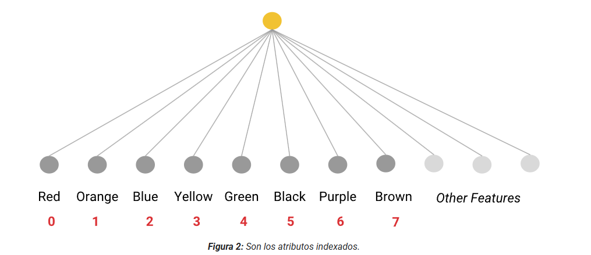

# Datos Categóricos
## Introducción

Los datos categóricos tienen una conjunto específico de valores posibles. Por ejemplo:
- Las diferentes especies de animales en un parque nacional.
- Los nombres de las calles de una ciudad en particular.
- Si un correo electrónico es o no spam.
- Números agrupados.

### Los números también pueden ser datos categóricos

Los verdaderos datos numéricos pueden ser significativamente multiplicados. Imagina un modelo que predice el precio de una casa en función de su área.  Ten en cuenta que un modelo útil para evaluar los precios de las casas suele basarse en centenas de atributos. Dicho esto, si todo lo demás es igual, una casa de 200 metros cuadrados debería tener aproximadamente el doble de valor que una casa idéntica de 100 metros cuadrados.

A menudo, debes representar los atributos que contienen valores enteros como datos categóricos en lugar de datos numéricos. Por ejemplo, considera una solicitud en el que los valores son números enteros. Si representas esto, de forma numérica en lugar de categórico, le pedirás al modelo para encontrar una relación numérica entre distintos códigos postales. Es decir, le estás diciendo al modelo que trate el código postal 20004 como una señal dos veces (o la mitad) más grande que el código postal 10002. La representación de códigos postales como datos categóricos le permite al modelo ponderar cada código postal individual por separado.

### Codificación

Codificación significa convertir datos categóricos o de otro tipo en vectores numéricos con los que un modelo puede entrenarse. Esta conversión es necesaria porque los modelos solo pueden entrenarse con valores de punto flotante; no pueden entrenarse con cadenas como "dog" o "maple". En este módulo, se explican los diferentes métodos de codificación para datos categóricos.

## Vocabulario y codificación one-hot

El término dimensión es sinónimo de la cantidad de elementos en un vector de atributos. Algunos atributos categóricos son de baja dimensión. Por ejemplo:

|Nombre del atributo|Cantidad de categorías|Categorías de ejemplo|
|--|--|--|
|snowed_today|2|Verdadero, Falso|
|skill_level|3|Principiante, profesional y experto|
|season|4|Invierno, primavera, verano y otoño|

Cuando un atributo categórico tiene una cantidad baja de categorías posibles, puedes codificarlo como un vocabulario. Con una codificación de vocabulario, el modelo trata cada valor categórico posible como un atributo independiente. Durante el entrenamiento, el modelo aprende diferentes pesos para cada categoría.

### Números de índice

Los modelos de aprendizaje automático solo pueden manipular números de punto flotante. Por lo tanto, debes convertir cada cadena en un número de índice único, como se muestra en la siguiente ilustración:



Después de convertir las cadenas en números de índice únicos, deberás procesar los datos aún más para representarlos de maneras que ayuden al modelo a aprender relaciones significativas entre los valores. Si los datos de atributos categóricos se dejan como números enteros indexados y se cargan en un modelo, este tratará los valores indexados como números de punto flotante continuos. Luego, el modelo consideraría que "púrpura" es seis veces más probable que "naranja".

### Codificación one-hot

El siguiente paso para crear un vocabulario es convertir cada número de índice en su codificación one-hot. En una codificación one-hot, se hace lo siguiente:
- Cada categoría se representa con un vector (array) de N elementos, donde N es la cantidad de categorías. Por ejemplo, si car_color tiene ocho categorías posibles, el vector de representación one-hot tendrá ocho elementos.
- Exactamente uno de los elementos de un vector de codificación one-hot tiene el valor 1.0; todos los elementos restantes tienen el valor 0.0.

Por ejemplo, en la siguiente tabla, se muestra la codificación one-hot para cada color en car_color:

| Función     | Rojo | Orange | Azul | Amarillo | Verde | Negro | Púrpura | Marrón |
|-------------|------|--------|------|----------|-------|-------|---------|-------|
| "Rojo"      | 1    | 0      | 0    | 0        | 0     | 0     | 0       | 0     |
| "Orange"    | 0    | 1      | 0    | 0        | 0     | 0     | 0       | 0     |
| "Azul"      | 0    | 0      | 1    | 0        | 0     | 0     | 0       | 0     |
| "Amarillo"  | 0    | 0      | 0    | 1        | 0     | 0     | 0       | 0     |
| "Verde"     | 0    | 0      | 0    | 0        | 1     | 0     | 0       | 0     |
| "Black"     | 0    | 0      | 0    | 0        | 0     | 1     | 0       | 0     |
| "Morado"    | 0    | 0      | 0    | 0        | 0     | 0     | 1       | 0     |
| "Marrón"    | 0    | 0      | 0    | 0        | 0     | 0     | 0       | 1     |

El vector one-hot, no la cadena ni el número de índice, es lo que se pasa al vector de atributos. El modelo aprende un peso independiente para cada elemento del vector de atributos.

En una codificación one-hot verdadera, solo un elemento tiene el valor 1.0. En una variante conocida como codificación multi-hot, varios valores pueden ser 1.0.

### Representación dispersa
Un atributo cuyos valores son predominantemente cero (o están vacíos) se denomina atributo disperso. Muchos atributos categóricos, como car_color, tienden a ser atributos dispersos. La representación dispersa significa almacenar la posición del 1.0 en un vector disperso. Por ejemplo, el vector one-hot para "Blue" es el siguiente:

```python 
[0, 0, 1, 0, 0, 0, 0, 0]
```

Dado que 1 está en la posición 2 (cuando se comienza el recuento en 0), la representación dispersa del vector one-hot anterior es la siguiente:

```python 
2
```

Ten en cuenta que la representación dispersa consume mucha menos memoria que el vector de un solo valor activo de ocho elementos. Es importante destacar que el modelo debe entrenarse con el vector codificado con un solo 1, no con la representación dispersa.

La representación dispersa de una codificación multi-hot almacena las posiciones de todos los elementos distintos de cero. Por ejemplo, la representación dispersa de un automóvil que es tanto "Blue" como "Black" es 2, 5.

### Valores atípicos en los datos categóricos

Al igual que los datos numéricos, los datos categóricos también contienen valores atípicos. Supongamos que car_color contiene no solo los colores populares, sino también algunos colores atípicos que se usan con poca frecuencia, como "Mauve" o "Avocado". En lugar de asignar a cada uno de estos colores atípicos una categoría separada, puedes agruparlos en una sola categoría "comodín" llamada fuera del vocabulario (OOV). En otras palabras, todos los colores atípicos se agrupan en un solo bucket de valores atípicos. El sistema aprende un solo peso para ese bucket de valores atípicos.

### Codificación de atributos categóricos de alta dimensión
Algunos atributos categóricos tienen una gran cantidad de dimensiones, como los que se muestran en la siguiente tabla:

| Nombre del atributo    | Cantidad de categorías    | Categorías de ejemplo      |
|-------------------------|---------------------------|------------------------------|
| words_in_english        | Alrededor de 500,000      | "feliz", "caminando"         |
| US_postal_codes         | Aprox. 42,000              | "02114", "90301"             |
| last_names_in_Germany   | Aproximadamente 850,000   | "Schmidt", "Schneider"       |

Cuando la cantidad de categorías es alta, la codificación one-hot suele ser una mala opción. Las incorporaciones suelen ser una opción mucho mejor. Los embeddings reducen considerablemente la cantidad de dimensiones, lo que beneficia a los modelos de dos maneras importantes:
- Por lo general, el modelo se entrena más rápido.
- El modelo compilado suele inferir predicciones más rápidamente. Es decir, el modelo tiene una latencia más baja.

La codificación hash (también llamada truco de codificación hash) es una forma menos común de reducir la cantidad de dimensiones.

En resumen, el hashing asigna una categoría (por ejemplo, un color) a un número entero pequeño, que es el número del "bucket" que contendrá esa categoría.

En detalle, implementa un algoritmo de hash de la siguiente manera:
1. Establece la cantidad de discretizaciones en el vector de categorías en N, donde N es menor que la cantidad total de categorías restantes. Como ejemplo arbitrario, supongamos que N = 100.
2. Elige una función hash. (A menudo, también elegirás el rango de valores hash).
3. Pasa cada categoría (por ejemplo, un color en particular) a través de esa función de hash, lo que generará un valor de hash, por ejemplo, 89237.
4. Asigna a cada discretización un número de índice del valor hash de salida módulo N. En este caso, en el que N es 100 y el valor hash es 89237, el resultado del módulo es 37 porque 89237 % 100 es 37.
5. Crea una codificación one-hot para cada discretización con estos nuevos números de índice.

## Problemas habituales con los datos categóricos

Los datos numéricos suelen registrarse con instrumentos científicos o medidas automatizadas. Por otro lado, los datos categóricos suelen categorizarse por seres humanos o por modelos de aprendizaje automático (AA). Quién decide sobre las categorías y las etiquetas, y cómo toma esas decisiones, afecta la confiabilidad y la utilidad de esos datos.

### Evaluadores humanos

Los datos etiquetados de forma manual por seres humanos a menudo se denominan etiquetas de oro y se consideran más convenientes que los datos etiquetados por máquinas para el entrenamiento de modelos, debido a que tienen una calidad de datos relativamente mejor.

Esto no significa necesariamente que cualquier conjunto de datos etiquetados por humanos sea de alta calidad. Los errores humanos, los sesgos y la malicia pueden introducirse en el momento de la recopilación de datos o durante la limpieza y el procesamiento de datos. Verifica si los tienes antes del entrenamiento.

Cualquier ser humano puede etiquetar el mismo ejemplo de manera diferente. La diferencia entre las decisiones de los evaluadores humanos se denomina acuerdo entre evaluadores. Puedes obtener una idea de la variación en las opiniones de los evaluadores si usas varios evaluadores por ejemplo y mides el acuerdo entre evaluadores.

Las siguientes son formas de medir el acuerdo entre calificadores:
- Kappa de Cohen y variantes
- Correlación intraclase (ICC)
- Alfa de Krippendorff

### Calificadores de máquinas
Los datos etiquetados por máquinas, en los que uno o más modelos de clasificación determinan automáticamente las categorías, a menudo se denominan etiquetas plateadas. La calidad de los datos etiquetados por máquinas puede variar mucho. Verifica no solo la precisión y los sesgos, sino también para detectar infracciones del sentido común, la realidad y la intención. Por ejemplo, si un modelo de visión artificial etiqueta erróneamente una foto de un chihuahua como un panecillo o una foto de un panecillo como un chihuahua, los modelos entrenados con esos datos etiquetados serán de menor calidad.

Del mismo modo, un analizador de opinión que califica las palabras neutrales como -0.25, cuando 0.0 es el valor neutral, podría asignar una puntuación a todas las palabras con un sesgo negativo adicional que no está presente en los datos. Un detector de toxicidad demasiado sensible puede marcar falsamente muchas afirmaciones neutrales como tóxicas. Intenta obtener una idea de la calidad y los sesgos de las etiquetas y anotaciones de máquinas en tus datos antes de entrenarlos.

### Alta dimensionalidad

Los datos categóricos suelen producir vectores de atributos de alta dimensión, es decir, que tienen una gran cantidad de elementos. La alta dimensionalidad aumenta los costos de entrenamiento y dificulta el entrenamiento. Por estos motivos, los expertos en AA suelen buscar formas de reducir la cantidad de dimensiones antes del entrenamiento.

En el caso de los datos de lenguaje natural, el método principal para reducir la dimensionalidad es convertir los vectores de atributos en vectores de incorporación.

## Combinaciones de atributos

Las combinaciones de atributos se crean combinando (tomando el producto cartesiano) dos o más atributos categóricos o agrupados del conjunto de datos. Al igual que las transformaciones de polinomios, las combinaciones de atributos permiten que los modelos lineales manejen las no linealidades. Las combinaciones de atributos también codifican las interacciones entre los atributos.

Por ejemplo, considera un conjunto de datos de hoja con los atributos categóricos:
- edges, que contiene los valores smooth, toothed y lobed
- arrangement, que contiene los valores opposite y alternate

Supongamos que el orden anterior es el orden de las columnas de atributos en una representación one-hot, de modo que una hoja con smooth bordes y una disposición opposite se representa como {(1, 0, 0), (1, 0)}.

La combinación de atributos, o producto cartesiano, de estos dos atributos sería la siguiente:

```
{Smooth_Opposite, Smooth_Alternate, Toothed_Opposite, Toothed_Alternate, Lobed_Opposite, Lobed_Alternate}
```

en el que el valor de cada término es el producto de los valores de los atributos base, de modo que:
- Smooth_Opposite = edges[0] * arrangement[0]
- Smooth_Alternate = edges[0] * arrangement[1]
- Toothed_Opposite = edges[1] * arrangement[0]
- Toothed_Alternate = edges[1] * arrangement[1]
- Lobed_Opposite = edges[2] * arrangement[0]
- Lobed_Alternate = edges[2] * arrangement[1]

Por ejemplo, si una hoja tiene un borde lobed y una disposición alternate, el vector de combinación de características tendrá un valor de 1 para Lobed_Alternate y un valor de 0 para todos los demás términos:

```
{0, 0, 0, 0, 0, 1}
```

Este conjunto de datos se podría usar para clasificar las hojas por especie de árbol, ya que estas características no varían dentro de una especie.

Las combinaciones de atributos son algo análogas a las transformaciones polinómicas. Ambas combinan varios atributos en un nuevo atributo sintético con el que el modelo puede entrenarse para aprender no linealidad. Por lo general, las transformaciones polinómicas combinan datos numéricos, mientras que las intersecciones de atributos combinan datos categóricos.

### Cuándo usar cruces de atributos

El conocimiento del dominio puede sugerir una combinación útil de atributos para cruzar. Sin ese conocimiento del dominio, puede ser difícil determinar manualmente las combinaciones de atributos o las transformaciones polinómicas eficaces. A menudo, es posible, si es costoso en términos de procesamiento, usar redes neuronales para encontrar y aplicar automáticamente combinaciones de características útiles durante el entrenamiento.

Ten cuidado: cruzar dos atributos dispersos produce un atributo nuevo aún más disperso que los dos originales. Por ejemplo, si el atributo A es un atributo disperso de 100 elementos y el atributo B es un atributo disperso de 200 elementos, una combinación de atributos de A y B genera un atributo disperso de 20,000 elementos.
